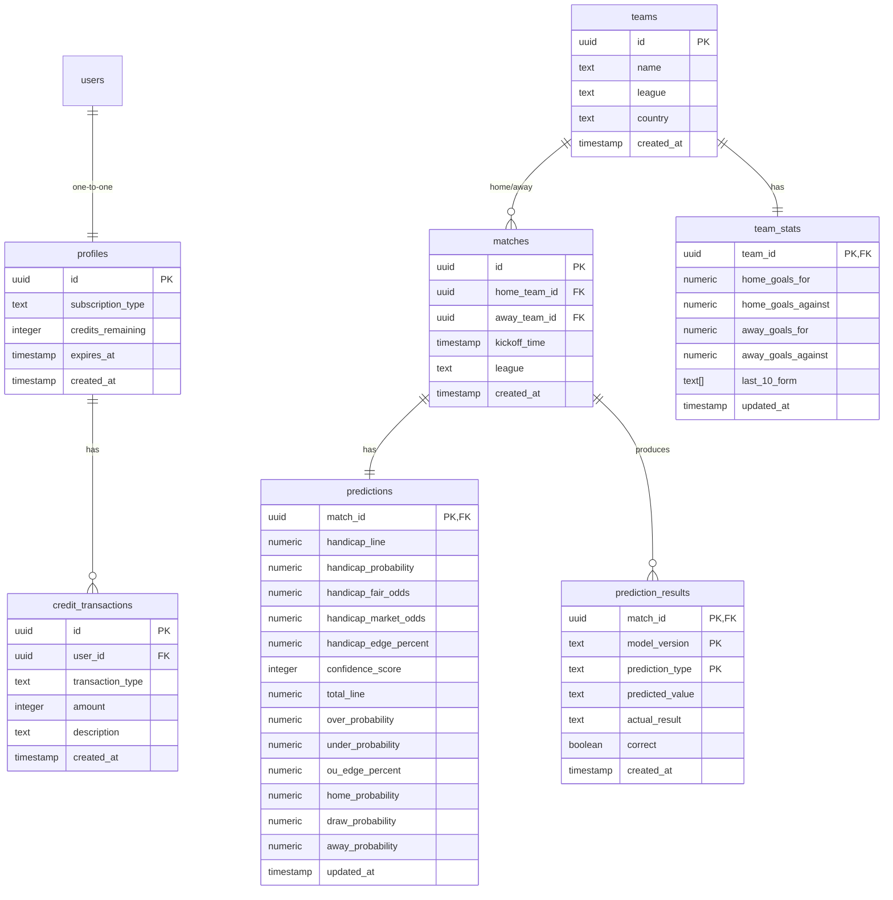

# HandicapLab - Database Schema Documentation

This document describes the PostgreSQL database schema for the **HandicapLab** application, designed to run in Supabase.

---

## Tables

### 1. `profiles`
Extends Supabase's `auth.users` table to track subscription levels, credit counts, and access expiration.

| Column | Type | Constraints | Description |
|---|---|---|---|
| `id` | `uuid` | `PRIMARY KEY`, `REFERENCES auth.users` | Links directly to auth user. |
| `subscription_type` | `text` | `NOT NULL`, `CHECK ('free', 'premium', 'lifetime')` | Subscription tier. |
| `credits_remaining` | `integer` | `NOT NULL`, `DEFAULT 10`, `CHECK (>= 0)` | Available credits for analysis. |
| `expires_at` | `timestamptz` | `NULL` | Premium subscription expiration timestamp. |
| `created_at` | `timestamptz` | `NOT NULL`, `DEFAULT now()` | Profile creation date. |

### 2. `teams`
List of football clubs across analyzed leagues.

| Column | Type | Constraints | Description |
|---|---|---|---|
| `id` | `uuid` | `PRIMARY KEY`, `DEFAULT gen_random_uuid()` | Unique team ID. |
| `name` | `text` | `NOT NULL` | Team name (e.g. `Arsenal`). |
| `league` | `text` | `NOT NULL` | Competition (e.g. `English Premier League`). |
| `country` | `text` | `NOT NULL` | Country of origin. |
| `created_at` | `timestamptz` | `NOT NULL`, `DEFAULT now()` | Timestamp. |

### 3. `matches`
Scheduled or completed fixtures.

| Column | Type | Constraints | Description |
|---|---|---|---|
| `id` | `uuid` | `PRIMARY KEY`, `DEFAULT gen_random_uuid()` | Unique match ID. |
| `home_team_id` | `uuid` | `NOT NULL`, `REFERENCES teams(id)` | Home team ID. |
| `away_team_id` | `uuid` | `NOT NULL`, `REFERENCES teams(id)` | Away team ID. |
| `kickoff_time` | `timestamptz` | `NOT NULL` | Kickoff date/time. |
| `league` | `text` | `NOT NULL` | League name. |
| `created_at` | `timestamptz` | `NOT NULL`, `DEFAULT now()` | Timestamp. |

*Constraint:* `home_team_id <> away_team_id`

### 4. `team_stats`
Aggregated goals and form history for predictive model inputs.

| Column | Type | Constraints | Description |
|---|---|---|---|
| `team_id` | `uuid` | `PRIMARY KEY`, `REFERENCES teams(id)` | Linked team ID. |
| `home_goals_for` | `numeric` | `NOT NULL`, `DEFAULT 0` | Average home goals scored. |
| `home_goals_against` | `numeric` | `NOT NULL`, `DEFAULT 0` | Average home goals conceded. |
| `away_goals_for` | `numeric` | `NOT NULL`, `DEFAULT 0` | Average away goals scored. |
| `away_goals_against` | `numeric` | `NOT NULL`, `DEFAULT 0` | Average away goals conceded. |
| `last_10_form` | `text[]` | `NOT NULL`, `DEFAULT '{}'` | Array of last 10 outcomes (e.g. `{'W', 'D', 'L'}`). |
| `updated_at` | `timestamptz` | `NOT NULL`, `DEFAULT now()` | Stat refresh timestamp. |

### 5. `predictions`
Probabilities, odds, and edge percentages calculated by the analytics engine.

| Column | Type | Constraints | Description |
|---|---|---|---|
| `match_id` | `uuid` | `PRIMARY KEY`, `REFERENCES matches(id)` | Linked match. |
| `handicap_line` | `numeric` | `NOT NULL` | Asian Handicap line (e.g., `-0.25`). |
| `handicap_probability` | `numeric` | `NOT NULL`, `CHECK (0..1)` | Probability of target handicap outcome. |
| `handicap_fair_odds` | `numeric` | `NOT NULL`, `CHECK (>= 1.0)` | Mathematically derived fair odds (`1 / probability`). |
| `handicap_market_odds` | `numeric` | `NOT NULL`, `CHECK (>= 1.0)` | Current average bookmaker odds. |
| `handicap_edge_percent` | `numeric` | `NOT NULL` | Calculated edge value (`(market_odds * probability) - 1`). |
| `confidence_score` | `integer` | `NOT NULL`, `CHECK (0..100)` | Model confidence score based on form consistency. |
| `total_line` | `numeric` | `NOT NULL` | Over/Under Goals line (e.g. `2.5`). |
| `over_probability` | `numeric` | `NOT NULL`, `CHECK (0..1)` | Probability of total goals exceeding line. |
| `under_probability` | `numeric` | `NOT NULL`, `CHECK (0..1)` | Probability of total goals staying under line. |
| `ou_edge_percent` | `numeric` | `NOT NULL` | Calculated edge for the value option. |
| `home_probability` | `numeric` | `NOT NULL`, `CHECK (0..1)` | Moneyline home win probability. |
| `draw_probability` | `numeric` | `NOT NULL`, `CHECK (0..1)` | Moneyline draw probability. |
| `away_probability` | `numeric` | `NOT NULL`, `CHECK (0..1)` | Moneyline away win probability. |
| `updated_at` | `timestamptz` | `NOT NULL`, `DEFAULT now()` | Last run timestamp. |

### 6. `prediction_results`
Backtest results mapping predictions to actual match outcomes.

| Column | Type | Constraints | Description |
|---|---|---|---|
| `match_id` | `uuid` | `PRIMARY KEY`, `REFERENCES matches(id)` | Match. |
| `model_version` | `text` | `PRIMARY KEY` | Engine version used (e.g. `poisson_v1.0`). |
| `prediction_type` | `text` | `PRIMARY KEY`, `CHECK` | Type: `asian_handicap`, `over_under`, `moneyline`. |
| `predicted_value` | `text` | `NOT NULL` | What was predicted (e.g., `over_2.5`, `home_-0.5`). |
| `actual_result` | `text` | `NULL` | Real-world result. |
| `correct` | `boolean` | `NULL` | Evaluation score. |
| `created_at` | `timestamptz` | `NOT NULL`, `DEFAULT now()` | Creation timestamp. |

### 7. `credit_transactions`
Auditing table for monetization tracking.

| Column | Type | Constraints | Description |
|---|---|---|---|
| `id` | `uuid` | `PRIMARY KEY`, `DEFAULT gen_random_uuid()` | Unique transaction ID. |
| `user_id` | `uuid` | `NOT NULL`, `REFERENCES profiles(id)` | Profile ID. |
| `transaction_type` | `text` | `NOT NULL`, `CHECK` | Type: `purchase`, `usage`, `bonus`, `refund`. |
| `amount` | `integer` | `NOT NULL` | Credit amount (positive for additions, negative for usages). |
| `description` | `text` | `NULL` | Custom note (e.g., `Purchased 50-credit package`). |
| `created_at` | `timestamptz` | `NOT NULL`, `DEFAULT now()` | Transaction timestamp. |
