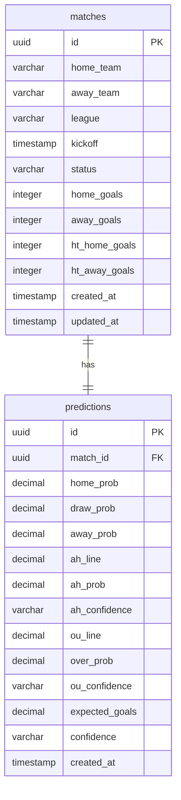

# HandicapLab - Simplified Database Schema Documentation

This document describes the simplified PostgreSQL database schema for the **HandicapLab** application, designed to run in Supabase.

---

## Tables

### 1. `matches`
Scheduled or completed fixtures.

| Column | Type | Constraints | Description |
|---|---|---|---|
| `id` | `uuid` | `PRIMARY KEY`, `DEFAULT gen_random_uuid()` | Unique match ID. |
| `home_team` | `varchar(100)` | `NOT NULL` | Home team name. |
| `away_team` | `varchar(100)` | `NOT NULL` | Away team name. |
| `league` | `varchar(50)` | `NOT NULL` | Competition/league name. |
| `kickoff` | `timestamp` | `NOT NULL` | Kickoff date/time. |
| `status` | `varchar(20)` | `DEFAULT 'upcoming'` | Match status (`upcoming`, `live`, `finished`). |
| `home_goals` | `integer` | `NULL` | Home team goals scored (after match ends). |
| `away_goals` | `integer` | `NULL` | Away team goals scored (after match ends). |
| `ht_home_goals` | `integer` | `NULL` | Halftime home goals. |
| `ht_away_goals` | `integer` | `NULL` | Halftime away goals. |
| `created_at` | `timestamp` | `DEFAULT now()` | Ingest timestamp. |
| `updated_at` | `timestamp` | `DEFAULT now()` | Last update timestamp. |

### 2. `predictions`
Poisson engine predictions mapped to matches.

| Column | Type | Constraints | Description |
|---|---|---|---|
| `id` | `uuid` | `PRIMARY KEY`, `DEFAULT gen_random_uuid()` | Unique prediction ID. |
| `match_id` | `uuid` | `REFERENCES matches(id) ON DELETE CASCADE` | Linked match ID. |
| `home_prob` | `decimal(5,4)` | `NOT NULL` | Moneyline home win probability. |
| `draw_prob` | `decimal(5,4)` | `NOT NULL` | Moneyline draw probability. |
| `away_prob` | `decimal(5,4)` | `NOT NULL` | Moneyline away win probability. |
| `ah_line` | `decimal(3,2)` | `NOT NULL` | Asian Handicap line (e.g. `-0.75`). |
| `ah_prob` | `decimal(5,4)` | `NOT NULL` | Asian Handicap cover probability. |
| `ah_confidence` | `varchar(10)` | `NOT NULL` | Asian Handicap confidence indicator dot. |
| `ou_line` | `decimal(3,1)` | `NOT NULL` | Over/Under Goals line (e.g. `2.5`). |
| `over_prob` | `decimal(5,4)` | `NOT NULL` | Over goals probability. |
| `ou_confidence` | `varchar(10)` | `NOT NULL` | Over/Under confidence indicator dot. |
| `expected_goals` | `decimal(3,2)` | `NULL` | Estimated combined match expected goals. |
| `confidence` | `varchar(10)` | `NOT NULL` | Combined confidence indicator dot (`🟢 High`, `🟡 Medium`, `⚪ Low`, `🔴 Avoid`). |
| `model_version` | `varchar(50)` | `DEFAULT 'prematch-v1'` | Model version ID. |
| `feature_version` | `varchar(50)` | `DEFAULT 'basic-v1'` | Feature engineer set ID. |
| `generated_at` | `timestamp` | `DEFAULT now()` | Timestamp when predictions were computed. |
| `prediction_timestamp` | `timestamp` | `NULL` | Projected kickoff timestamp of the match. |
| `odds_snapshot` | `jsonb` | `NULL` | Market odds snapshot (contains AH line, homeOdds, awayOdds, etc.). |
| `created_at` | `timestamp` | `DEFAULT now()` | Creation timestamp. |

### 3. `prediction_results`
Evaluated results of finished matches, tracking outcome hits and bet yields.

| Column | Type | Constraints | Description |
|---|---|---|---|
| `id` | `uuid` | `PRIMARY KEY`, `DEFAULT gen_random_uuid()` | Unique result ID. |
| `prediction_id` | `uuid` | `REFERENCES predictions(id) ON DELETE CASCADE` | Linked prediction. |
| `match_id` | `uuid` | `REFERENCES matches(id) ON DELETE CASCADE` | Linked match. |
| `actual_home_score` | `integer` | `NOT NULL` | Actual goals scored by home team. |
| `actual_away_score` | `integer` | `NOT NULL` | Actual goals scored by away team. |
| `predicted_outcome` | `varchar(10)` | `NOT NULL` | Predicted moneyline ('home', 'draw', 'away'). |
| `actual_outcome` | `varchar(10)` | `NOT NULL` | Actual moneyline outcome ('home', 'draw', 'away'). |
| `hit_1x2` | `boolean` | `NOT NULL` | True if moneyline prediction won. |
| `predicted_ah` | `varchar(20)` | `NOT NULL` | Predicted Asian Handicap side ('home', 'away'). |
| `actual_ah` | `varchar(20)` | `NOT NULL` | Actual Asian Handicap side covering the line. |
| `hit_ah` | `boolean` | `NOT NULL` | True if Asian Handicap prediction won. |
| `predicted_ou` | `varchar(10)` | `NOT NULL` | Predicted Over/Under ('over', 'under'). |
| `actual_ou` | `varchar(10)` | `NOT NULL` | Actual Over/Under result. |
| `hit_ou` | `boolean` | `NOT NULL` | True if Over/Under prediction won. |
| `profit_1x2` | `decimal(5,2)` | `NULL` | Units profit/loss from 1X2 bet. |
| `profit_ah` | `decimal(5,2)` | `NULL` | Units profit/loss from AH bet. |
| `profit_ou` | `decimal(5,2)` | `NULL` | Units profit/loss from OU bet. |
| `created_at` | `timestamp` | `DEFAULT now()` | Creation timestamp. |

