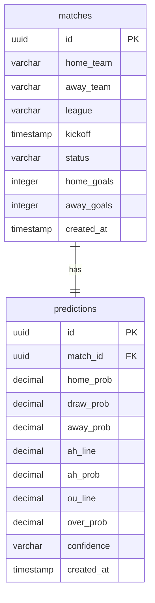

# HandicapLab - Simplified Database Schema Documentation

This document describes the simplified PostgreSQL database schema for the **HandicapLab** application, designed to run in Supabase.

---

## Tables

### 1. `matches`
Scheduled or completed fixtures.

| Column | Type | Constraints | Description |
|---|---|---|---|
| `id` | `uuid` | `PRIMARY KEY`, `DEFAULT gen_random_uuid()` | Unique match ID. |
| `home_team` | `varchar(100)` | `NOT NULL` | Home team name. |
| `away_team` | `varchar(100)` | `NOT NULL` | Away team name. |
| `league` | `varchar(50)` | `NOT NULL` | Competition/league name. |
| `kickoff` | `timestamp` | `NOT NULL` | Kickoff date/time. |
| `status` | `varchar(20)` | `DEFAULT 'upcoming'` | Match status (`upcoming`, `live`, `finished`). |
| `home_goals` | `integer` | `NULL` | Home team goals scored (after match ends). |
| `away_goals` | `integer` | `NULL` | Away team goals scored (after match ends). |
| `created_at` | `timestamp` | `DEFAULT now()` | Ingest timestamp. |

### 2. `predictions`
Poisson engine predictions mapped to matches.

| Column | Type | Constraints | Description |
|---|---|---|---|
| `id` | `uuid` | `PRIMARY KEY`, `DEFAULT gen_random_uuid()` | Unique prediction ID. |
| `match_id` | `uuid` | `REFERENCES matches(id) ON DELETE CASCADE` | Linked match ID. |
| `home_prob` | `decimal(5,4)` | `NOT NULL` | Moneyline home win probability. |
| `draw_prob` | `decimal(5,4)` | `NOT NULL` | Moneyline draw probability. |
| `away_prob` | `decimal(5,4)` | `NOT NULL` | Moneyline away win probability. |
| `ah_line` | `decimal(3,2)` | `NOT NULL` | Asian Handicap line (e.g. `-0.75`). |
| `ah_prob` | `decimal(5,4)` | `NOT NULL` | Asian Handicap cover probability. |
| `ou_line` | `decimal(3,1)` | `NOT NULL` | Over/Under Goals line (e.g. `2.5`). |
| `over_prob` | `decimal(5,4)` | `NOT NULL` | Over goals probability. |
| `confidence` | `varchar(10)` | `NOT NULL` | Confidence indicator dot (`🟢 High`, `🟡 Medium`, `⚪ Low`, `🔴 Avoid`). |
| `created_at` | `timestamp` | `DEFAULT now()` | Creation timestamp. |
