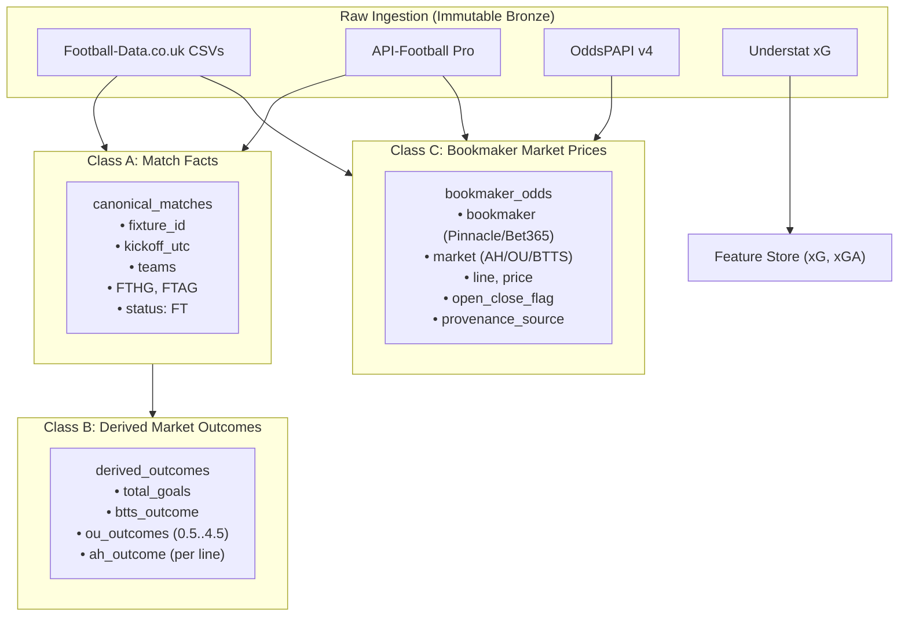

# Historical Data Provenance & Canonical Transformation Specification
**Version:** 1.0.0  
**Date:** 2026-09-03T20:12:00+07:00  
**Status:** CANONICAL ARCHITECTURAL INVARIANT  
**Principle:** Real Data Only • Free-First • Provenance-First • No Fabrication  

---

## 1. Provenance Architecture & Chain of Custody

Every historical observation utilized in HandicapLab research, model training, or backtesting must possess an unbroken, verifiable provenance chain:

```text
SOURCE FILE / ENDPOINT
    ↓
SOURCE COLUMN / JSON PROPERTY
    ↓
BOOKMAKER IDENTITY
    ↓
MARKET FAMILY (AH | OU | BTTS)
    ↓
SELECTION / SIDE (Home | Away | Over | Under | Yes | No)
    ↓
MARKET LINE (-0.5 | +0.25 | 2.5 | etc.)
    ↓
DECIMAL PRICE (Odds)
    ↓
OPEN / CLOSE TIMING SEMANTICS
    ↓
CANONICAL FIXTURE ID
    ↓
MATCH FACTS (Final Score)
    ↓
DETERMINISTIC SETTLEMENT (Win | Half-Win | Push | Half-Loss | Loss)
```

If any link in this chain is missing, ambiguous, or unverifiable, **the record is strictly quarantined and barred from profitability backtesting.**

---

## 2. Separation of Data Classes

The HandicapLab data architecture strictly segregates data into three orthogonal classes. Merging these classes into ambiguous polymorphic records is prohibited.



### Class A: Match Facts (Deterministic Reality)
Match facts record physical occurrences on the pitch, free from betting interpretations.
- `fixture_id`: Deterministic hash (`canonical_${league}_${season}_${date}_${home}_${away}`).
- `league_id`: Standardized competition key (e.g. `ENG-PL`, `ESP-LALIGA`).
- `season`: Season string (`2024-2025`, `2025-2026`).
- `kickoff_utc`: UTC kickoff timestamp.
- `home_team`, `away_team`: Standardized club names.
- `FTHG`: Full-Time Home Goals (integer $\ge 0$).
- `FTAG`: Full-Time Away Goals (integer $\ge 0$).
- `HTHG`, `HTAG`: Half-Time Home/Away Goals (integer $\ge 0$, when present).
- `status`: Verified terminal status (`FT`, `AET`).

### Class B: Derived Market Outcomes (Deterministic Settlement)
Outcomes computed mathematically from Class A match facts. These represent **objective market results**, completely independent of whether bookmaker odds were recorded.
- `total_goals` $= \text{FTHG} + \text{FTAG}$.
- `btts_outcome`: $\text{YES}$ if $\text{FTHG} > 0 \land \text{FTAG} > 0$; else $\text{NO}$.
- `ou_outcome(line)`: Deterministic Over/Under evaluation.
- `ah_outcome(line, side)`: Deterministic Asian Handicap evaluation.

### Class C: Bookmaker Market Prices (Economic Observations)
Empirical odds offered by licensed wagering operators.
- `bookmaker`: Ground-truth bookmaker identity (e.g. `Pinnacle`, `Bet365`, `SBOBET`).
- `market`: Market identifier (`ASIAN_HANDICAP`, `OVER_UNDER`, `BTTS`).
- `selection`: Bet selection (`HOME`, `AWAY`, `OVER`, `UNDER`, `YES`, `NO`).
- `line`: Specific market line (e.g. `-0.75`, `+0.25`, `2.5`).
- `price`: Decimal price (odds $> 1.0$).
- `timing`: Explicit classification (`OPENING`, `CLOSING`).
- `source`: Upstream source file and column name.

---

## 3. Forensic Column Provenance (Football-Data.co.uk)

The following mappings have been proven from the official Football-Data.co.uk specification (`notes.txt`) and verified against raw data rows:

### 3.1 Asian Handicap (AH) Provenance

| Source Column | Proven Bookmaker | Market | Selection | Line Column | Timing Semantics | Provenance Definition |
|---|---|---|---|---|---|---|
| `AHh` | Market / Aggregator | AH | Reference | Self | Opening Line | Home handicap line (e.g. `-0.5`, `+0.25`) |
| `PAHH` | **Pinnacle** | AH | Home | `AHh` | **Opening Price** | Pinnacle Asian Handicap Home odds |
| `PAHA` | **Pinnacle** | AH | Away | `AHh` (inverted) | **Opening Price** | Pinnacle Asian Handicap Away odds |
| `AHCh` | Market / Aggregator | AH | Reference | Self | Closing Line | Closing home handicap line |
| `PCAHH` | **Pinnacle** | AH | Home | `AHCh` | **Closing Price (CLV Benchmark)** | Pinnacle Closing Asian Handicap Home odds |
| `PCAHA` | **Pinnacle** | AH | Away | `AHCh` (inverted) | **Closing Price (CLV Benchmark)** | Pinnacle Closing Asian Handicap Away odds |
| `B365AHH` | Bet365 | AH | Home | `AHh` | Opening Price | Bet365 Asian Handicap Home odds |
| `B365AHA` | Bet365 | AH | Away | `AHh` | Opening Price | Bet365 Asian Handicap Away odds |
| `B365CAHH` | Bet365 | AH | Home | `AHCh` | Closing Price | Bet365 Closing Asian Handicap Home odds |
| `B365CAHA` | Bet365 | AH | Away | `AHCh` | Closing Price | Bet365 Closing Asian Handicap Away odds |
| `AvgAHH` | Market Average | AH | Home | `AHh` | Opening Price | Market consensus average |
| `AvgCAHH` | Market Average | AH | Home | `AHCh` | Closing Price | Market consensus closing average |

### 3.2 Over / Under (OU) Provenance

| Source Column | Proven Bookmaker | Market | Selection | Line | Timing Semantics | Provenance Definition |
|---|---|---|---|---|---|---|
| `P>2.5` | **Pinnacle** | OU | Over | 2.50 | **Opening Price** | Pinnacle Over 2.5 goals odds |
| `P<2.5` | **Pinnacle** | OU | Under | 2.50 | **Opening Price** | Pinnacle Under 2.5 goals odds |
| `PC>2.5` | **Pinnacle** | OU | Over | 2.50 | **Closing Price (CLV Benchmark)** | Pinnacle Closing Over 2.5 goals odds |
| `PC<2.5` | **Pinnacle** | OU | Under | 2.50 | **Closing Price (CLV Benchmark)** | Pinnacle Closing Under 2.5 goals odds |
| `B365>2.5` | Bet365 | OU | Over | 2.50 | Opening Price | Bet365 Over 2.5 goals odds |
| `B365C>2.5` | Bet365 | OU | Over | 2.50 | Closing Price | Bet365 Closing Over 2.5 goals odds |

---

## 4. Authoritative Settlement Logic

### 4.1 Asian Handicap Exact Settlement Rules
Let $\Delta = (\text{Home Goals} - \text{Away Goals}) + \text{Handicap Line}$.

| Handicap Remainder ($\Delta \pmod{0.5}$) | Condition | Home Selection Result | Away Selection Result | Payout Multiplier |
|---|---|---|---|---|
| **Full Line (e.g. 0, -1, +1)** | $\Delta > 0$ | `WIN` | `LOSS` | Price |
| | $\Delta = 0$ | `PUSH` | `PUSH` | $1.0$ (Stake returned) |
| | $\Delta < 0$ | `LOSS` | `WIN` | $0.0$ |
| **Half-Ball (e.g. -0.5, +0.5)** | $\Delta > 0$ | `WIN` | `LOSS` | Price |
| | $\Delta < 0$ | `LOSS` | `WIN` | $0.0$ |
| **Quarter-Ball (Split: e.g. -0.25, +0.25)** | $\Delta = +0.25$ | `HALF_WIN` | `HALF_LOSS` | $1 + \frac{\text{Price} - 1}{2}$ |
| | $\Delta = -0.25$ | `HALF_LOSS` | `HALF_WIN` | $0.5$ (Half stake lost) |
| | $\Delta > +0.25$ | `WIN` | `LOSS` | Price |
| | $\Delta < -0.25$ | `LOSS` | `WIN` | $0.0$ |

*Quarter-ball lines must NEVER be simplified into binary win/loss outcomes.*

### 4.2 Over / Under Quarter-Ball Settlement Rules
Let $G = \text{FTHG} + \text{FTAG}$, and $L = \text{Market Goal Line}$.
Let $D = G - L$.

| Offset ($D$) | Over Selection | Under Selection |
|---|---|---|
| $D \ge +0.5$ | `WIN` | `LOSS` |
| $D = +0.25$ | `HALF_WIN` | `HALF_LOSS` |
| $D = 0$ | `PUSH` | `PUSH` |
| $D = -0.25$ | `HALF_LOSS` | `HALF_WIN` |
| $D \le -0.5$ | `LOSS` | `WIN` |

### 4.3 BTTS Deterministic Reconstruction
- If $\text{FTHG} \ge 1 \land \text{FTAG} \ge 1 \implies \text{BTTS Outcome} = \text{YES}$.
- Else $\implies \text{BTTS Outcome} = \text{NO}$.
- *Scope Rule:* Historical BTTS outcomes are derived with 100% mathematical certainty from match facts. BTTS bookmaker odds are absent from free historical archives; therefore, BTTS models evaluate historical probability calibration and log-loss/Brier scores, but **not historical price ROI.**

---

## 5. Statistical Enrichment: Understat Invariants

1. **Role of Understat:** Understat data (`xG`, `xGA`, `xPTS`, shots, deep completions) functions exclusively as **feature enrichment** (model inputs).
2. **Strict Wall of Separation:** Understat values must **never** be used to synthesize, impute, or adjust betting odds.
3. **No Synthetic Lines:** No "fair odds" generated from xG may ever be stored in Class C bookmaker tables.
