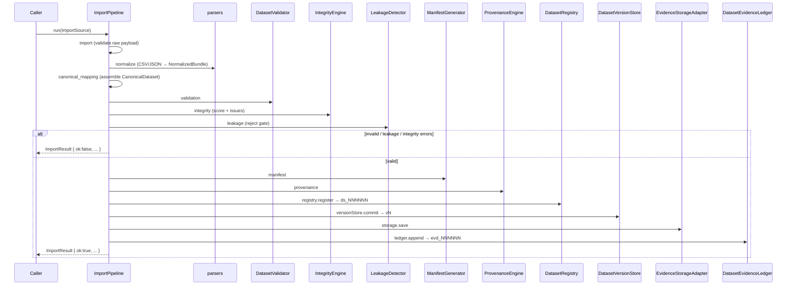

# HandicapLab — Historical Evidence Platform

**Type:** Architecture & Module Reference
**Phase:** 4 — Platform & Operations
**Status:** Implemented (Sprints A1–A12)
**Module:** `src/lib/evidence-platform/`
**ADR:** [ADR-037](./adr/ADR-037-historical-evidence-platform.md)

---

## Purpose

The Historical Evidence Platform is the **single source of truth** for every
replay, experiment, benchmark, calibration study, feature study, and shadow-mode
execution. It guarantees that every historical dataset is:

- **Reproducible** — permanent id, checksum, and order-independent fingerprint.
- **Auditable** — provenance travels through the replay engine; every dataset
  becomes an immutable evidence artifact.
- **Statistically trustworthy** — integrity verification, coverage analysis, and
  leakage detection reject invalid datasets before they reach research.

The platform depends downward only on the canonical dataset schema
(`src/lib/dataset`) and the shared identifier factory (`src/lib/registry`). It
never imports from higher layers (Invariant 5).

---

## Module Map

```
src/lib/evidence-platform/
├── types.ts               # All platform contracts + constants
├── hash.ts                # sha256, checksumOfSource, fingerprintDataset
├── seasonRegistry.ts      # A1 — supported leagues/seasons, providers, aliases
├── datasetRegistry.ts     # A2 — permanent dataset identity (ds_NNNNNN)
├── manifestGenerator.ts   # A3 — exportable dataset manifests (JSON)
├── integrityEngine.ts     # A4 — 12 integrity checks + numeric score
├── coverageAnalyzer.ts    # A5 — per-league coverage metrics
├── leakageDetector.ts     # A6 — future/result/closing/feature leakage
├── provenanceEngine.ts    # A7 — immutable provenance records
├── datasetVersionStore.ts # A8 — immutable v1/v2/v3 dataset versions
├── diffEngine.ts          # A9 — machine-readable dataset diffs
├── parsers.ts             # A10 — CSV/JSON parsing + normalization
├── importPipeline.ts      # A10 — staged ingestion orchestrator + storage
├── evidenceLedger.ts      # A11 — dataset evidence artifacts (evd_NNNNNN)
├── reporting.ts           # A12 — markdown/json/csv reports
└── index.ts               # Public API barrel
```

### Dependency direction

```
importPipeline ──> parsers ──> dataset (canonical schema)
      │  │  │
      │  │  └──> integrityEngine, manifestGenerator, leakageDetector
      │  └─────> provenanceEngine, datasetRegistry, datasetVersionStore, evidenceLedger
      └────────> hash
reporting ──> types (+ dataset validator types)
replay/types ──(type-only, optional)──> evidence-platform/types (DatasetProvenance)
```

---

## Import Pipeline Sequence (A10)



---

## Public API (selected)

All exports are available from `@/lib/evidence-platform`.

### A1 — Season Registry
```ts
const reg = new SeasonRegistry();
reg.resolveLeague('premier league');       // SupportedLeague | null
reg.getSeasonsForLeague('comp:epl', true); // active seasons
reg.querySeasons({ provider: 'api-football', minStartYear: 2020 });
reg.isProviderAvailable(seasonId, 'football-data');
```

### A2 — Dataset Registry
```ts
const registry = new DatasetRegistry();
const entry = registry.register({ provider, leagueId, seasonId, sourcePath,
  checksum, fingerprint, fileSize, rowCount, integrityScore }); // ds_NNNNNN (frozen)
registry.findByFingerprint(fingerprint);
registry.query({ status: 'validated', minIntegrityScore: 90 });
```

### A3 — Manifest Generator
```ts
const manifest = new ManifestGenerator().generate({ dataset, checksum,
  provider, competition, season });
new ManifestGenerator().toJSON(manifest);
```

### A4 — Integrity Engine
```ts
const report = new IntegrityEngine().verify(dataset); // score 0–100 + issues
```

### A5 — Coverage Analyzer
```ts
const coverage = new CoverageAnalyzer().analyze(dataset, {
  fixturesWithXg, fixturesWithLineups, fixturesWithInjuries, fixturesWithWeather });
```

### A6 — Leakage Detector
```ts
const leak = new LeakageDetector().detect(dataset, {
  flagClosingOdds: true, featureTimestamps }); // passed=false → reject
```

### A7 — Provenance Engine
```ts
const prov = new ProvenanceEngine().fromDataset(dataset, rawSource,
  { provider, version, source });
```

### A8 — Dataset Versioning
```ts
const store = new DatasetVersionStore();
store.commit('comp:epl:season:epl:2024-2025', dataset); // v1, v2, v3 (immutable)
store.getLatest(key);
```

### A9 — Diff Engine
```ts
const diff = new DiffEngine().diff(fromDataset, toDataset);
// addedFixtures, removedFixtures, changedOdds, changedTimestamps, changedMetadata
```

### A10 — Import Pipeline
```ts
const result = new ImportPipeline().run({
  format: 'csv' | 'json' | 'api', provider, leagueId, seasonId, sourcePath,
  raw, csvColumnMap });
```

### A11 — Evidence Ledger
```ts
const artifact = new DatasetEvidenceLedger().append({ datasetId, checksum,
  fingerprint, integrityScore, validationResult }); // evd_NNNNNN (frozen)
```

### A12 — Reporting
```ts
import { reporting } from '@/lib/evidence-platform';
reporting.datasetReportMarkdown(entry, manifest);
reporting.integrityReportMarkdown(report);
reporting.integrityReportCSV(report);
reporting.coverageReportMarkdown(coverage);
reporting.coverageReportCSV(coverage);
reporting.validationReportMarkdown(validationReport);
reporting.manifestToJSON(manifest);
```

---

## Integrity Checks (A4)

| Check | Severity | Rejects import? |
|---|---|---|
| duplicate_fixtures | error | ✅ |
| missing_ids | error | ✅ |
| missing_kickoff | error | ✅ |
| invalid_scores | error | ✅ |
| invalid_odds | error | ✅ |
| negative_odds | error | ✅ |
| duplicate_matches | error | ✅ |
| missing_teams | error | ✅ |
| missing_competitions | error | ✅ |
| timezone_consistency | warning | ❌ |
| chronological_ordering | warning | ❌ |
| missing_bookmakers | warning | ❌ |

**Score** = `round(100 × passedChecks / 12 − 0.5 × warnings)`, clamped `[0,100]`.

---

## Leakage Checks (A6)

| Check | Trigger | Severity |
|---|---|---|
| future_data | odds timestamp after kickoff | error |
| result_leakage | result on non-finished fixture | error |
| post_match_field | post-match field before completion | error |
| feature_timestamp | feature known after kickoff | error |
| closing_odds | closing odds present | warning |

Any error-severity issue sets `passed=false`, causing the import pipeline to
reject the dataset (Invariant 11 — No Future Information).

---

## Invariant Compliance

| Invariant | How satisfied |
|---|---|
| 4 — Immutable after finalization | Registry entries, provenance, versions, artifacts are `Object.freeze`d |
| 5 — No reverse dependencies | Platform imports only `dataset` + `registry/identifiers` downward |
| 6 — Reproducible artifacts | checksum (raw) + fingerprint (canonical) on every dataset |
| 7 — Centralized identifiers | `generateId(ID_PREFIX.DATASET | EVIDENCE)` |
| 11 — No future information | LeakageDetector rejection gate in import pipeline |
| 13 — Provenance to source | `DatasetProvenance` travels through `ReplayContext` |
| 14 — Append-only history | Version store + evidence ledger never overwrite |
| 16 — Backward compatible | Only additive optional `ReplayContext.provenance` field |

---

## Tests

`tests/evidence-platform/` — 74 unit tests across 5 suites (registries,
quality, pipeline-safety, import-ledger, reporting). Run:

```bash
npx vitest run tests/evidence-platform/
```
