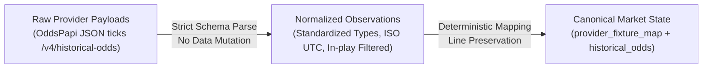

# Market State Schema & State Separation Specification

**Document Version:** 1.0.0  
**Status:** APPROVED (Phase 1 Baseline)  
**Location:** `docs/MARKET_STATE_SCHEMA.md`  
**Governing EPIC:** Positive-Yield Handicap Research Engine  

---

## 1. Architectural Philosophy: Three-Tier State Separation

To eliminate all ambiguity, data pollution, and post-hoc leakage, the research engine enforces an absolute mathematical and architectural separation between three core data concepts:

```text
+-----------------------------------------------------------------------------------+
| 1. FOOTBALL STATE (Physical World Reality)                                        |
|    Fixtures, Kickoff Timestamps, Final Scores, HT Scores, Team Stats, Lineups     |
+-----------------------------------------------------------------------------------+
                                         |
                                         v
+-----------------------------------------------------------------------------------+
| 2. MARKET STATE (Betting Exchange / Bookmaker Microstructure)                     |
|    Bookmaker Identity, Market Type, Line, Price, Tick Timestamps, Capture Window   |
+-----------------------------------------------------------------------------------+
                                         |
                                         v
+-----------------------------------------------------------------------------------+
| 3. MODEL STATE (Statistical & Algorithmic Derivations)                            |
|    Model Version, Fitted Parameters, Probabilities, Fair Odds, Expected Value     |
+-----------------------------------------------------------------------------------+
```

Each tier possesses **independent provenance** metadata. A football score never borrows market data, and a market quote never mutates historical football facts.

---

## 2. Transformation Pipeline: RAW $\to$ NORMALIZED $\to$ CANONICAL

Historical market quotes follow a strict, immutable progression:



1. **RAW**: Untouched provider responses preserved on disk in `data/historical/oddspapi/raw/`.
2. **NORMALIZED**: In-memory and intermediate records validated against strict schemas, with invalid odds ($o \le 1.0$) discarded and in-play ticks ($t \ge T_{\text{kickoff}}$) flagged.
3. **CANONICAL MARKET STATE**: Persistent rows mapped to canonical match IDs, with discrete lines preserved and multi-horizon timestamps recorded.

---

## 3. Database DDL & Table Specifications

### 3.1 `provider_fixture_map` (Fixture Crosswalk Table)
Maps external provider match IDs to the canonical match ID deterministically.

```sql
CREATE TABLE IF NOT EXISTS public.provider_fixture_map (
  provider TEXT NOT NULL,                     -- e.g. 'oddspapi', 'apifootball'
  provider_event_id TEXT NOT NULL,            -- e.g. 'id1000001761300977'
  canonical_match_id TEXT NOT NULL,           -- e.g. 'ENG-PL|2025-2026|2026-02-01|aston-villa|brentford'
  mapping_status TEXT NOT NULL CHECK (
    mapping_status IN ('MAPPED', 'UNMAPPED', 'AMBIGUOUS', 'CONFLICT')
  ),
  mapping_method TEXT NOT NULL CHECK (
    mapping_method IN ('PROVIDER_ID', 'TEAM_ALIAS_DATE', 'TEAM_NORMALIZED_DATE', 'NONE')
  ),
  confidence NUMERIC(4, 3) NOT NULL CHECK (confidence >= 0.0 AND confidence <= 1.0),
  home_team TEXT NOT NULL,
  away_team TEXT NOT NULL,
  kickoff TIMESTAMPTZ NOT NULL,
  reason TEXT,
  created_at TIMESTAMPTZ NOT NULL DEFAULT NOW(),
  updated_at TIMESTAMPTZ NOT NULL DEFAULT NOW(),
  PRIMARY KEY (provider, provider_event_id)
);

CREATE INDEX IF NOT EXISTS idx_provider_fixture_map_canonical
  ON public.provider_fixture_map (canonical_match_id);
```

### 3.2 `historical_odds` (Canonical Market State Table)
Preserves the complete price timeline across discrete horizons without line collapse.

```sql
CREATE TABLE IF NOT EXISTS public.historical_odds (
  odds_id TEXT PRIMARY KEY,                   -- SHA-256(canonical_id | market | line | observation | bookmaker)
  canonical_id TEXT NOT NULL,                 -- References canonical match ID
  league_id TEXT NOT NULL,                    -- e.g. 'ENG-PL', 'DEU-BUNDESLIGA'
  cluster TEXT,                               -- League tier / cluster
  season TEXT NOT NULL,                       -- e.g. '2025-2026'
  match_date DATE NOT NULL,                   -- YYYY-MM-DD
  market TEXT NOT NULL CHECK (
    market IN ('ML', 'AH', 'OU', 'BTTS')
  ),
  observation TEXT NOT NULL CHECK (
    observation IN ('opening', 'closing', 'T_7D', 'T_72H', 'T_24H', 'T_6H', 'T_1H', 'T_15M')
  ),
  bookmaker_source TEXT NOT NULL,             -- e.g. 'pinnacle', 'sbobet'
  line NUMERIC(5, 2),                         -- Discrete line (e.g. -0.25, 2.75; NULL for ML/BTTS)
  home_odds NUMERIC(8, 4),
  draw_odds NUMERIC(8, 4),
  away_odds NUMERIC(8, 4),
  over_odds NUMERIC(8, 4),
  under_odds NUMERIC(8, 4),
  yes_odds NUMERIC(8, 4),
  no_odds NUMERIC(8, 4),
  odds_timestamp TIMESTAMPTZ,                 -- Exact tick timestamp from provider
  home_odds_timestamp TIMESTAMPTZ,
  away_odds_timestamp TIMESTAMPTZ,
  market_id INTEGER,                          -- Provider market catalog ID
  provider TEXT NOT NULL,                     -- e.g. 'oddspapi'
  provider_event_id TEXT NOT NULL,
  source_file TEXT,
  source_row INTEGER,
  dataset_version TEXT NOT NULL,
  ingestion_version TEXT NOT NULL,
  created_at TIMESTAMPTZ NOT NULL DEFAULT NOW()
);

CREATE INDEX IF NOT EXISTS idx_historical_odds_canonical
  ON public.historical_odds (canonical_id);

CREATE INDEX IF NOT EXISTS idx_historical_odds_market_line
  ON public.historical_odds (market, line);

CREATE INDEX IF NOT EXISTS idx_historical_odds_observation
  ON public.historical_odds (observation);
```

### 3.3 `model_predictions` (Reproducible Model State Table)
Logs exact point-in-time predictions with frozen features and model parameters.

```sql
CREATE TABLE IF NOT EXISTS public.model_predictions (
  prediction_id UUID PRIMARY KEY DEFAULT gen_random_uuid(),
  canonical_match_id TEXT NOT NULL,
  model_version TEXT NOT NULL,
  horizon TEXT NOT NULL CHECK (
    horizon IN ('T_7D', 'T_72H', 'T_24H', 'T_6H', 'T_1H', 'T_15M')
  ),
  prediction_timestamp TIMESTAMPTZ NOT NULL,
  fitted_parameters JSONB NOT NULL,          -- { homeAttack, awayAttack, rho, mu, gamma }
  feature_snapshot JSONB NOT NULL,           -- Point-in-time features strictly before prediction_timestamp
  market_snapshot_ref TEXT,                  -- Reference to historical_odds rows
  market_type TEXT NOT NULL,
  selection TEXT NOT NULL,
  line NUMERIC(5, 2),
  model_probability NUMERIC(6, 5) NOT NULL,
  fair_odds NUMERIC(8, 4) NOT NULL,
  market_odds NUMERIC(8, 4) NOT NULL,
  expected_value NUMERIC(6, 4) NOT NULL,
  edge NUMERIC(6, 4) NOT NULL,
  created_at TIMESTAMPTZ NOT NULL DEFAULT NOW()
);

CREATE INDEX IF NOT EXISTS idx_model_predictions_match_horizon
  ON public.model_predictions (canonical_match_id, horizon);
```

---

## 4. Invariants & Governance Rules

1. **Line Preservation Invariant**: Asian Handicap and Over/Under lines are stored at their native numerical precision ($0.25$ steps). Lines are **never** averaged, rounded, or collapsed into an arbitrary primary line.
2. **Immutability Invariant**: Historical price records are strictly append-only. Once recorded, an odds quote at timestamp $t$ is never overwritten.
3. **Zero Future Leakage Invariant**: Every record in `historical_odds` must satisfy $\text{odds\_timestamp} < \text{kickoff\_time}$. Any tick with $t \ge T_{\text{kickoff}}$ is discarded and audited.
4. **Independent Provenance**: Every row records `provider`, `provider_event_id`, `source_file`, `dataset_version`, and `ingestion_version` to guarantee 100% auditability.

