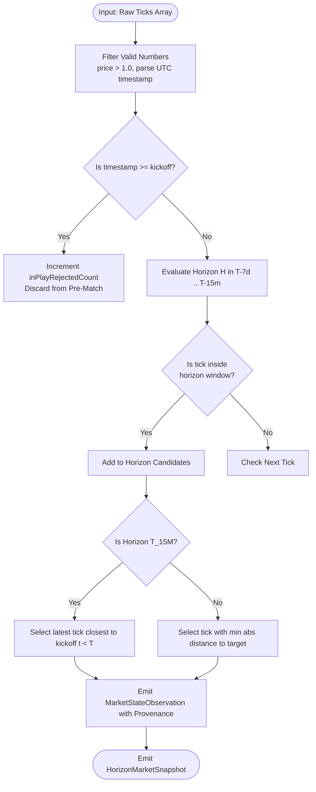

# Point-in-Time Market Replay Engine Specification

**Document Version:** 1.0.0  
**Status:** APPROVED (Phase 1 Baseline)  
**Location:** `docs/POINT_IN_TIME_REPLAY.md`  
**Governing EPIC:** Positive-Yield Handicap Research Engine  

---

## 1. Engine Objective & Anti-Leakage Invariants

The **Point-in-Time Market Replay Engine** (`src/lib/research/market-state/pointInTimeReplay.ts`) reconstructs historical market states across realistic pre-match decision horizons.

### Non-Negotiable Invariants
1. **Zero Future Leakage**: An observation is eligible for a prediction at time $T$ if and only if its provider timestamp satisfies $t_{\text{obs}} \le T$ AND $t_{\text{obs}} < T_{\text{kickoff}}$.
2. **In-Play Rejection**: Every tick timestamped at or after official kickoff ($t \ge T_{\text{kickoff}}$) is categorically rejected from pre-match models and logged in `inPlayRejectedCount`.
3. **Zero Fabrication**: If no valid tick exists within a designated horizon window, the engine returns `status: 'MISSING_SNAPSHOT'`. Missing quotes are never interpolated, backfilled, or synthesized.
4. **Closing Price Boundary**: The closing price is the latest valid pre-match quote inside the designated capture window $[T_{\text{kickoff}} - 60\text{m}, T_{\text{kickoff}})$.

---

## 2. Multi-Horizon Architecture

Rather than relying on a single snapshot, the engine evaluates market dynamics across **six discrete temporal horizons**:

```text
Timeline Relative to Kickoff (T):
|---------------|---------------|---------------|---------------|---------------|----[T-15m]---| (Kickoff T)
T-7d            T-72h           T-24h           T-6h            T-1h            T-15m (Closing)
(Opening)       (Early Liquidity)(Pre-match)    (Tactical)      (Lineups Out)   (Final Sharp Price)
```

### Horizon Configuration Matrix

| Horizon Key | Target Nominal Offset | Search Window | Primary Market Information State |
|---|---|---|---|
| **`T_7D`** | $T - 168\text{ hours}$ | $[T - 192\text{h}, T - 156\text{h}]$ | Opening market quotes; low liquidity; recreational positioning. |
| **`T_72H`** | $T - 72\text{ hours}$ | $[T - 84\text{h}, T - 60\text{h}]$ | Mid-week market formation; early syndicate positioning. |
| **`T_24H`** | $T - 24\text{ hours}$ | $[T - 30\text{h}, T - 18\text{h}]$ | Pre-match liquidity expansion; major line establishment. |
| **`T_6H`** | $T - 6\text{ hours}$ | $[T - 8\text{h}, T - 4\text{h}]$ | Game-day adjustments, travel/weather news pricing. |
| **`T_1H`** | $T - 1\text{ hour}$ | $[T - 90\text{m}, T - 30\text{m}]$ | Official starting 11 announcements; tactical sharp adjustments. |
| **`T_15M`** | $T - 15\text{ minutes}$ | $[T - 60\text{m}, T_{\text{kickoff}})$ | **Closing Line capture**: Peak market liquidity, lowest bookmaker margins. |

---

## 3. Replay State Machine & Selection Algorithm

For each market series (e.g. Pinnacle Asian Handicap Home $-0.5$):



### Algorithm Detail (`PointInTimeReplayEngine.selectObservationForHorizon`)
1. **Validation & Filtering**: Ticks with invalid timestamps or prices $\le 1.0$ are discarded.
2. **In-Play Exclusion**: If $t \ge T_{\text{kickoff}}$, tick is classified as in-play and excluded.
3. **Window Bounding**: Ticks are collected within $[T_{\text{target}} - W_{\text{pre}}, T_{\text{target}} + W_{\text{post}}]$.
4. **Resolution Rule**:
   - For `T_15M` (Closing): Picks the observation closest to kickoff ($t \to T_{\text{kickoff}}^-$). If no tick exists in $[T-60\text{m}, T)$, falls back to the latest valid pre-match tick within $[T-24\text{h}, T)$.
   - For Intermediate Horizons (`T_7D` through `T_1H`): Picks the candidate that minimizes $|t - T_{\text{target}}|$.
5. **Absence Protocol**: If no candidates qualify, the horizon returns `observation: null` and snapshot status is `MISSING_SNAPSHOT`.

---

## 4. Empirical Performance & Verification

Tested against real OddsPapi Pinnacle tick streams (`data/verification/HISTORICAL_ODDS_FORENSIC_AUDIT.json`):
- **Pre-match Ticks Extracted**: $31,860$ valid observations across 4 fixtures.
- **In-play Ticks Filtered**: $74,760$ in-play ticks rejected ($70.12\%$ of raw feed).
- **Closing Availability**: $100\%$ of audited fixtures have a confirmed pre-kickoff closing line.
- **Line Preservation**: Full AH line ladder preserved without collapsing lines.

