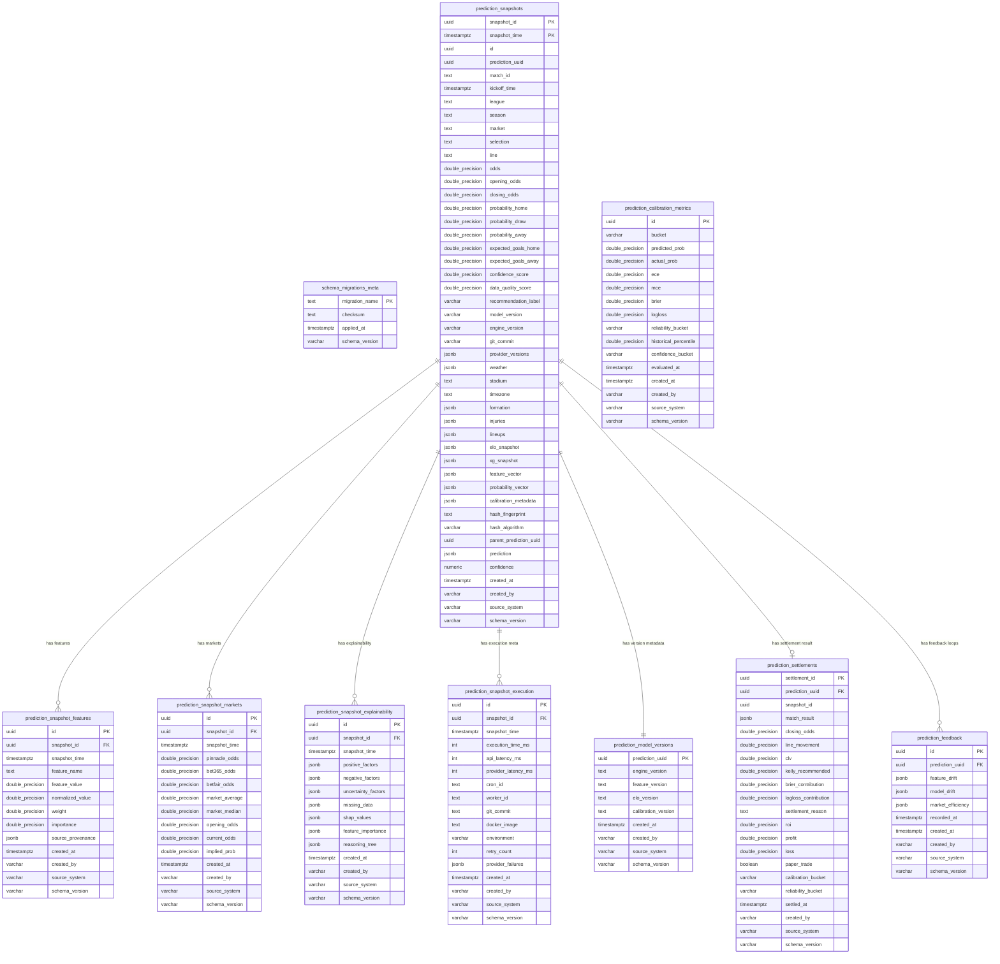

# Prediction Ledger v2 System Documentation

This document describes the schema architecture, design patterns, lifecycle flow, data dictionary, data sizing estimation, and maintenance policies for the **HandicapLab Prediction Ledger v2**.

---

## 1. Entity Relationship Diagram (ERD)

The ledger utilizes a star-schema-like design where `prediction_snapshots` serves as the central fact table partitioned by `snapshot_time`. All diagnostic, market, feature, and settlement tables relate back to this central snapshot.



---

## 2. Quantitative Architecture Lifecycle

```
[ Match scheduled ]
       │
       ▼
[ Feature Engine ]  ──(Build advanced inputs, e.g. ELO, goal pressure, fatigue)
       │
       ▼
[ Probability Engine ] ──(Dixon-Coles & Poisson distributions + Platt scaling calibration)
       │
       ▼
[ Edge Scanner ] ──(Find EV inefficiencies vs Pinnacle/Bet365 current bookmaker prices)
       │
       ├──────────────────────────────────────┐
       ▼ (Dual-Write)                         ▼ (Dual-Write)
[ Cache Table (Mutable) ]              [ Immutable Ledger Tables ]
- public.predictions                   - public.prediction_snapshots
- public.paper_trades                  - public.prediction_snapshot_features
                                       - public.prediction_snapshot_markets
                                       - public.prediction_snapshot_explainability
                                       - public.prediction_snapshot_execution
                                       - public.prediction_model_versions
                                              │
                                              ▼
                                       (Triggers Prevent UPDATES)
                                              │
                                              ▼ (Settlement Cron Runs)
                                       [ Settlement Pipeline ]
                                       - Settle match outcomes
                                       - Compute CLV (Closing Line Value)
                                       - Compute Brier / LogLoss metrics
                                       - Insert into public.prediction_settlements
                                       - Update public.prediction_calibration_metrics
                                       - Update public.prediction_feedback
```

---

## 3. Data Dictionary

### 3.1 `prediction_snapshots` (Fact Table, Partitioned)
- `snapshot_id` (UUID PK): Unique identifier for the snapshot.
- `prediction_uuid` (UUID): Identifier linking the prediction logically across version tables.
- `match_id` (TEXT): ID of the fixture.
- `snapshot_time` (TIMESTAMPTZ PK): Partition key. Time the snapshot was recorded.
- `recommendation_label` (VARCHAR): Conviction tier mapping (`High Conviction`, `Medium Conviction`, `Low Conviction`, `Observation`).
- `hash_fingerprint` (TEXT): SHA-256 string fingerprinting all inputs and probabilities.

### 3.2 `prediction_snapshot_features`
- `snapshot_id` (UUID): Reference to base snapshot.
- `feature_name` (TEXT): Name of the feature (e.g., `pressureFactor`, `fatigueFactor`).
- `feature_value` (DOUBLE PRECISION): Raw value.

### 3.3 `prediction_settlements`
- `settlement_id` (UUID PK): Unique settlement transaction ID.
- `prediction_uuid` (UUID): Associated prediction uuid.
- `clv` (DOUBLE PRECISION): Outperformance of opening odds vs closing odds.
- `brier_contribution` (DOUBLE PRECISION): Brier score component $(p - y)^2$.
- `logloss_contribution` (DOUBLE PRECISION): Logarithmic loss component.

---

## 4. Maintenance, Backup & Restore Strategy

### 4.1 Database Backup
Ledger tables are mission-critical. Weekly logical dumps and point-in-time recovery (PITR) must be configured:
```bash
# Export schema and data for ledger tables specifically
pg_dump -h <host> -U postgres -d postgres -t "public.prediction_snapshots*" -t "public.prediction_settlements" --clean --no-owner -f ledger_v2_backup.sql
```

### 4.2 Disaster Recovery / Restore
To restore ledger tables safely:
1. Temporarily disable the `enforce_snapshot_immutability` trigger:
   ```sql
   ALTER TABLE public.prediction_snapshots DISABLE TRIGGER enforce_snapshot_immutability;
   ```
2. Import the backup file.
3. Re-enable the immutability trigger:
   ```sql
   ALTER TABLE public.prediction_snapshots ENABLE TRIGGER enforce_snapshot_immutability;
   ```

---

## 5. Storage Sizing & Sizing Estimations

Since the ledger records structured arrays (features, odds, explainability vectors) in normalized relation columns instead of heavy unstructured JSON, database sizes scale linearly.

| Prediction Count | Core Snapshots (Fact) | Features (10/snap) | Explainability/Execution | Total Storage |
|---|---|---|---|---|
| **1,000,000** | ~350 MB | ~1.2 GB | ~450 MB | **~2.0 GB** |
| **10,000,000** | ~3.5 GB | ~12.0 GB | ~4.5 GB | **~20.0 GB** |
| **100,000,000** | ~35.0 GB | ~120.0 GB | ~45.0 GB | **~200.0 GB** |

### Recommendations for Large-Scale Data Sizing:
- **Partition Pruning:** Always include `snapshot_time` in query `WHERE` clauses to prevent table scans across multiple years.
- **Data Retention & Archiving:** Features older than 18 months can be archived to cold storage (e.g. AWS S3 or Supabase Storage) as CSVs, keeping only the base `prediction_snapshots` and `prediction_settlements` tables online in the Postgres database.
