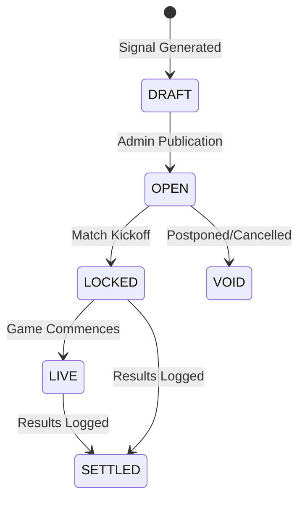

# Signal Delivery Layer

This document details the lifecycle, visibility guidelines, and delivery endpoints for predictions generated by HandicapLab.

---

## 1. Signal Status Lifecycle

HandicapLab signals transition through specific states to guarantee market verification and kickoff protection:

- **DRAFT**: Created by `SignalScanner`. Not publicly visible.
- **OPEN**: Published and active. Open for tracking/wagering.
- **LOCKED**: Kickoff reached. Prediction selections become immutable.
- **SETTLED**: Match completed and results resolved.
- **VOID**: Match cancelled, postponed, or voided.

---

## 2. API Contracts

### GET `/api/signals/feed`
Returns list of active signals with status `OPEN` or `LOCKED`.

- **Headers**:
  - `x-user-id` (optional): User UUID to determine entitlement tiers.
- **Parameters**:
  - `market` (optional): `AH` (default), `OU`, `ML`.
  - `limit` (optional): Page size, defaults to `20`.
- **Query Filter Mapping**:
  - `AH` -> `asian_handicap`
  - `OU` -> `over_under`
  - `ML` -> `moneyline`

### GET `/api/signals/[id]`
Returns details for a single signal. Also writes a `SIGNAL_VIEWED` audit snapshot to `signal_audit_events` and, if the user holds a premium entitlement, logs a `SIGNAL_UNLOCKED` audit trail.

---

## 3. Visibility & Gating Policies

HandicapLab leverages the `checkActiveEntitlement` check to enforce premium boundaries:

| Attribute | Free Visitors | Premium Tier (`LIFETIME_PRO`) |
| :--- | :--- | :--- |
| **Max signals returned** | Limit to `3` | Unlimited |
| **Current / Closing Odds** | Masked (`null`) | Fully Visible |
| **Model Advantage (Edge %)** | Masked (`null`) | Fully Visible |
| **Closing Line Value (CLV)** | Masked (`null`) | Fully Visible |
