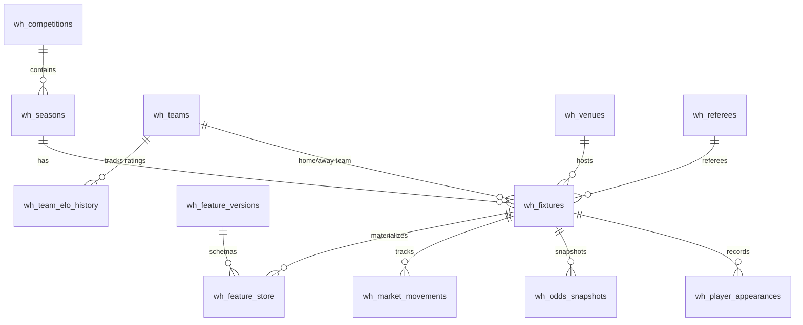
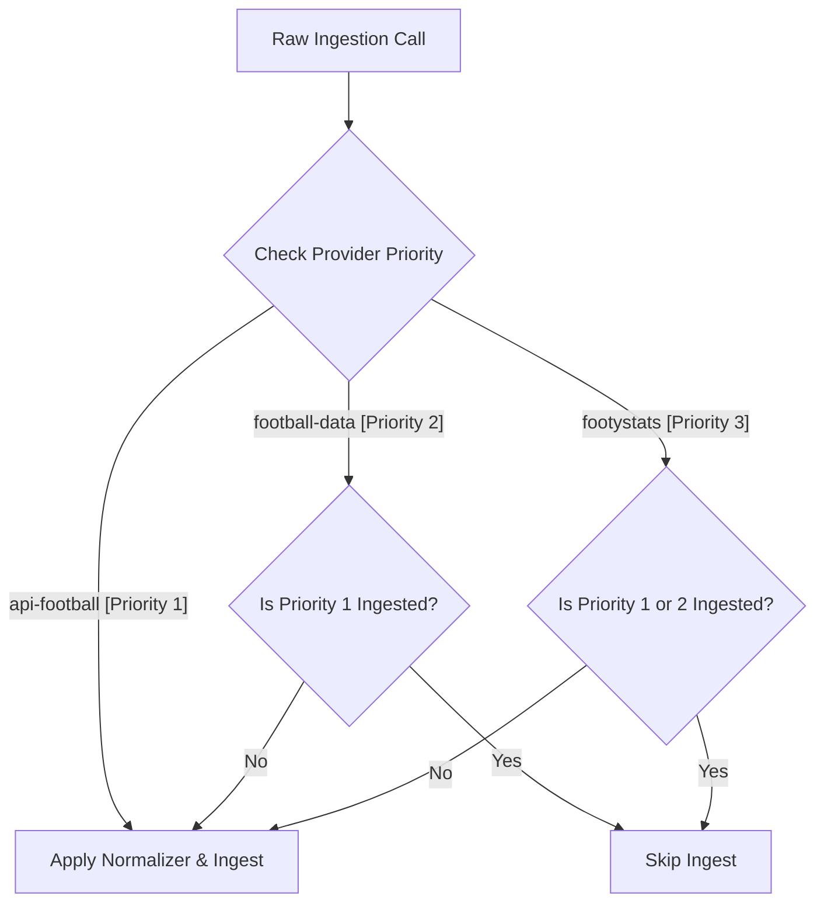

# Historical Data Platform & Feature Store Documentation

This document outlines the architecture, data structures, and storage estimations for the HandicapLab historical data warehouse.

---

## 1. ER Diagram

The relational layout of the historical warehouse tables (`wh_` prefix):

---

## 2. ETL Workflow & Provider Priority

Incoming raw fixtures from API providers are normalized and loaded using a priority conflict resolution model:

- **Checkpointing:** Incremental states are persisted in `wh_sync_checkpoints` to allow pausing and resuming sync routines.

---

## 3. Storage Estimates for 10 Years of Data

Below is the size projection for coverage of 50 active football competitions (averaging 380 matches per season):

* **Annual Fixtures:** $50 \text{ leagues} \times 380 \text{ matches} = 19,000 \text{ fixtures/year}$.
* **10-Year Accumulation:** $190,000 \text{ fixtures}$.

### Data Sizing Matrix

| Entity Table | Expected 10-Yr Rows | Average Row Size | Projected Storage |
| :--- | :--- | :--- | :--- |
| `wh_fixtures` | 190,000 | 5 KB (with details) | 950 MB |
| `wh_odds_snapshots` | 1,900,000 (10/fixture) | 120 Bytes | 228 MB |
| `wh_player_appearances`| 5,320,000 (28/fixture) | 150 Bytes | 798 MB |
| `wh_feature_store` | 950,000 (5 versions/fix) | 2 KB | 1.9 GB |
| Other Tables (ELO, etc.)| 500,000 | 100 Bytes | 50 MB |
| **Total projected size**| | | **~3.92 GB** |
