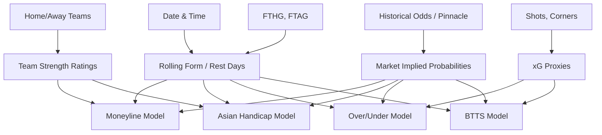

# Feature Dependency Map

## Supported Markets Dependency
- **Moneyline:** Heavily relies on Team Ratings, recent Form (W/D/L), and closing Pinnacle ML odds.
- **Asian Handicap:** Heavily relies on Goal Difference rolling averages, Home Advantage, and closing Pinnacle AH lines.
- **Over/Under:** Heavily relies on historical match goal averages, Shots on Target (xG proxies), and pace of play.
- **BTTS:** Relies on defensive/offensive consistency, and BTTS historical rates.
