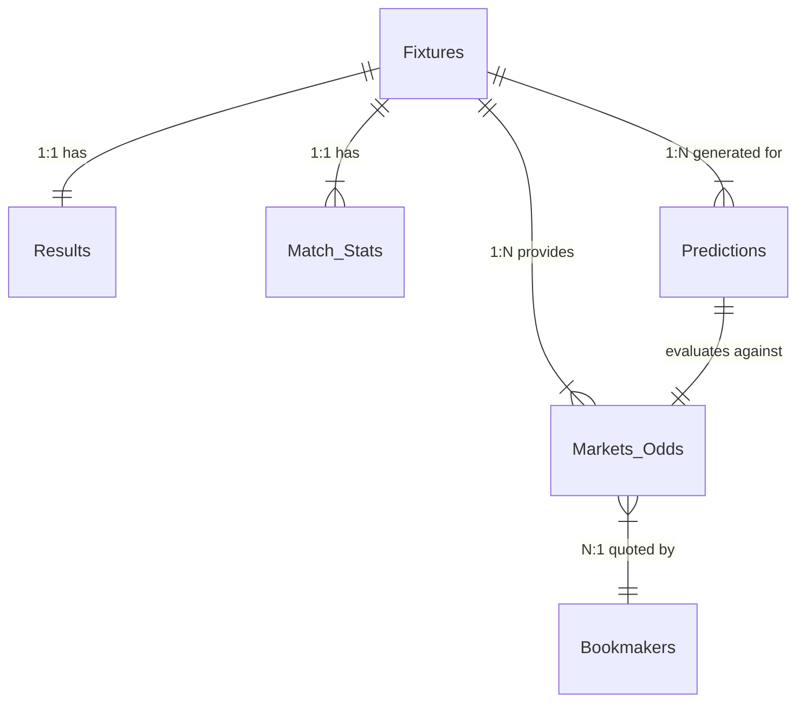

# Data Dependency Graph & Join Map

## Join Keys
- **Fixtures -> Results**: Join on `fixture_id`.
- **Fixtures -> Match_Stats**: Join on `fixture_id`.
- **Fixtures -> Markets_Odds**: Join on `fixture_id`.
- **Fixtures -> Predictions**: Join on `fixture_id`.

## Missing Relationships Identified
- Currently, datasets are flat CSVs. There is no explicit `fixture_id` joining them. We will need to generate a deterministic UUID based on `hash(date + home_team + away_team)` to reliably join odds files with results files if they are ever decoupled.
